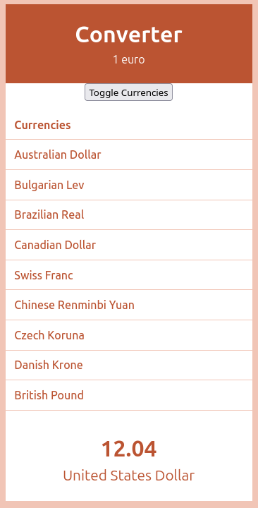
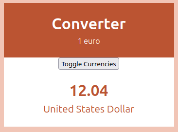
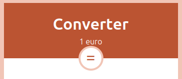
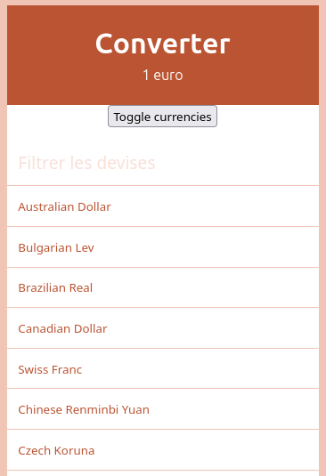
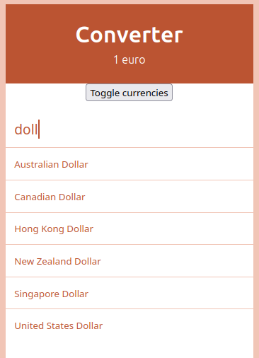

# Convertisseur

## Objectif

Réaliser ce projet

## 1 - Début de mise en place des composants React

- Identifier les composants React principaux
- Créer ces composants, avec un peu de style (pas grave si on n'a pas le même look, ou pas du tout de look. Se concentrer de préférence sur les fonctionnalités React :muscle:). A ce stade on utilisera 2 ou 3 devises en dur pour mettre au point le composant React correspondant

Notes :

- il n'y a pas de calcul de conversion à faire dans cette étape, c'est juste un affichage de devises
- le projet est déjà initialisé, tu auras juste à lancer `pnpm install` pour télécharger les dépendances, puis `pnpm run dev` pour voir le projet dans ton navigateur

### Charte graphique

La maquette utilise une font spéciale, on peut rester sur la police de base, ou choisir une police au choix si on sait gérer ça en CSS.

Couleurs :

- Principale `#bb5432`
- Alternative `#f1c5b6`
- Claire `#fff`

Durées de transition

- Rapide : `0.2s`
- Lente : `1s`

https://developer.mozilla.org/fr/docs/Web/CSS/transition

## 2 - Dynamisation avec un fichier de données

Utiliser les devises du fichier `src/data/currencies.ts`

## 3 - Un bouton pour pouvoir afficher ou masquer les devises

Mettre en place un bouton pour pouvoir afficher/masquer le bloc des devises

Rappel : en React on préfère ne pas afficher du tout un composant ou une partie de composant (affichage conditionnel), plutôt que de masquer avec du CSS.

Bonus pour les fans de CSS : améliorer le look du bouton :wink:

Par exemple :

## 4 - Filtrage des devises

Ajouter un champ texte qui permettrait de filtrer les devises, d'afficher uniquement celles qui contiennent le texte saisi. Le filtrage s'applique chaque fois qu'un caractère est saisi dans le champ.

Le champ texte utilise beaucoup de CSS sur cette maquette, tu peux rester sur un _input_ classique (petit, en gris avec une bordure), et éventuellement gérer le CSS ensuite si tu es fan de CSS. 

